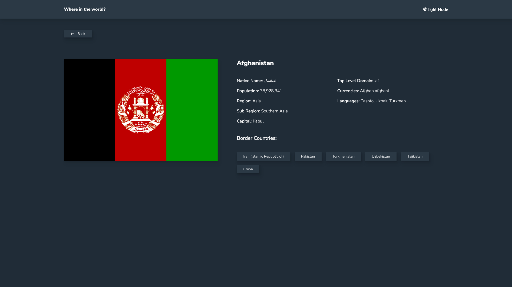
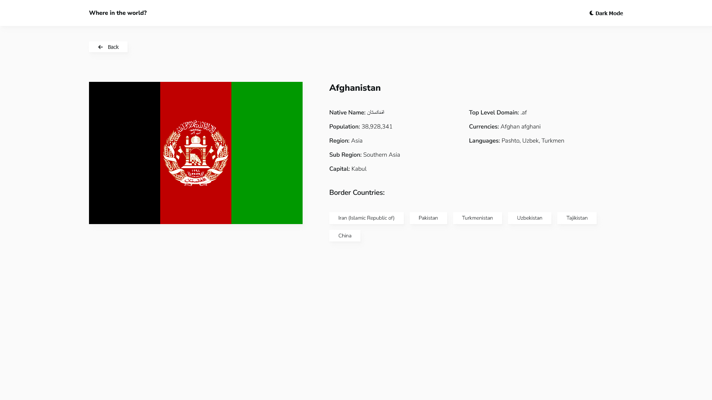
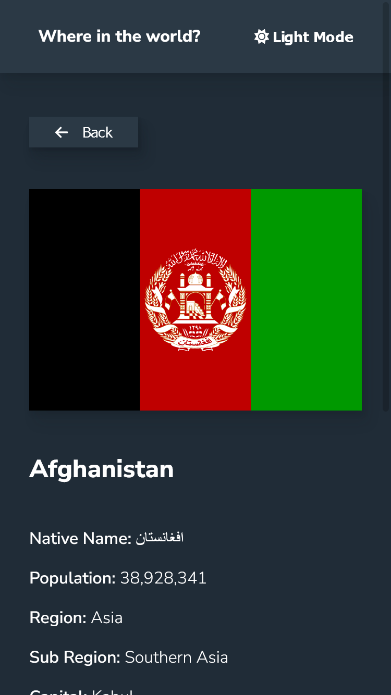
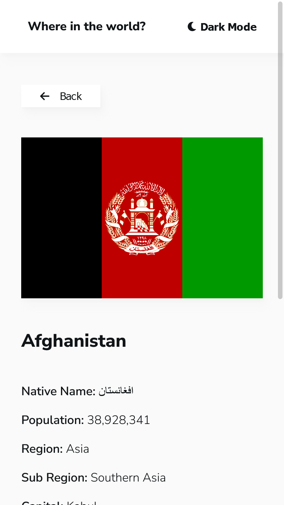

# Frontend Mentor - REST Countries API with color theme switcher solution

This is a solution to the [REST Countries API with color theme switcher challenge on Frontend Mentor](https://www.frontendmentor.io/challenges/rest-countries-api-with-color-theme-switcher-5cacc469fec04111f7b848ca). Frontend Mentor challenges help you improve your coding skills by building realistic projects. 

## Table of contents

- [Overview](#overview)
  - [The challenge](#the-challenge)
  - [Screenshots](#screenshots)
  - [Links](#links)
- [My process](#my-process)
  - [Built with](#built-with)
  - [What I learned](#what-i-learned)
  - [Continued development](#continued-development)
  - [Useful resources](#useful-resources)
- [Author](#author)

## Overview

### The challenge

Users should be able to:

- See all countries from the API on the homepage
- Search for a country using an `input` field
- Filter countries by region
- Click on a country to see more detailed information on a separate page
- Click through to the border countries on the detail page
- Toggle the color scheme between light and dark mode *(optional)*

### Screenshots











### Links

- [Solution URL](https://github.com/Haxikowy/fem-rest-api-countries)
- [Live Site URL](https://haxikowy.github.io/fem-rest-api-countries/#/)

## My process

### Built with

- Mobile-first workflow
- [React](https://reactjs.org/) - JS library
- [react-router](https://reactrouter.com/) - router used to navigate in app
- [react-redux](https://react-redux.js.org/) - React with redux state system
- [axios](https://github.com/axios/axios) - library used to make api calls
- [lodash](https://lodash.com/) - helps with math
- [FontAwesome](https://fontawesome.com/) - icons
- [SCSS](https://sass-lang.com/) - better css
- Flexbox(actually a lot of flexbox)

### What I learned

I practiced my React skills, I know this app doesn't require Redux to be here, but I really need to practice using it. I learned a lot about how hooks really works, eg. 
```js
useEffect(() => {
  function toMakeApiCall(){

  }  
}, [])
```
it makes only one call to api, something like componentDidMount() in class based components. I also struggled with 'endless' scrolling, it's not really piece of cake as I thought earlier. Apart from React & Redux skills I feel like a lot more confident with my CSS & layout building skills. I'm trying to make as little as possible breakpoints with media-queries, so I really need to use newest CSS features. I like how
```css
someSelector{
  --spacing: customSpacing;
  display: flex;
  flex-wrap: wrap
  gap: var(--spacing);
}
```
does a thing in this site, making it so easy to build. I really enjoyed whole creating process, it made me think about a lot of things, eg. I didn't really know how to use redux before.

### Continued development

I need to practice my React and also Redux building a bit larger applications, where using Redux isn't overkill.😁

### Useful resources

- [StackOverflow](https://stackoverflow.com/) - Every developer uses it
- [Google](https://google.com/) - Same as above
- [React documentation](https://pl.reactjs.org/)

## Author

- Website - [Haxikowy](https://github.com/Haxikowy)
- Frontend Mentor - [@haxikowy](https://www.frontendmentor.io/profile/haxikowy)